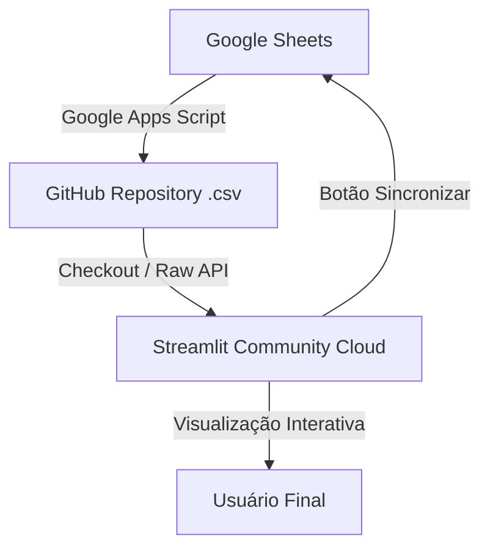

# 🚀 Template de Prompt Master: Criação de Dashboards Interativos (Streamlit + Google Sheets + GitHub)

Este documento contém a estrutura padronizada e o **Prompt Master** recomendado para criar novos dashboards executivos e operacionais utilizando a biblioteca **Streamlit**, **Python**, **Plotly** e a arquitetura de **sincronização automática via Google Apps Script e GitHub**.

---

## 📋 Como Usar Este Template

1. Copie o bloco de texto contido na seção **[PROMPT MASTER]** abaixo.
2. Preencha os campos entre colchetes `[EXEMPLO]` com as informações específicas da sua nova instituição, empresa ou conjunto de dados.
3. Cole o prompt diretamente para o **Antigravity AI** no início do projeto.

---

```markdown
# 🎯 PROMPT MASTER: CRIAR NOVO DASHBOARD EXECUTIVO INTERATIVO

Você é um engenheiro de dados e especialista em UX/UI sênior responsável por desenvolver um dashboard executivo e operacional completo usando Python e Streamlit.

---

## 1. OBJETIVO DO PROJETO
- **Nome do Projeto**: [Ex: Painel de Monitoramento de Educação / Vendas / Projetos]
- **Instituição / Empresa**: [Ex: Secretaria de Estado da Educação de PB / Empresa X]
- **Público-alvo**: [Ex: Gestores, Diretores, Técnicos e Público Geral]
- **Objetivo Principal**: [Ex: Monitorar indicadores de desempenho, matrículas e execução de metas em tempo real]

---

## 2. ARQUITETURA E TECNOLOGIAS
- **Linguagem**: Python 3.10+
- **Framework Web**: Streamlit (`st.set_page_config(layout="wide")`)
- **Visualização de Dados**: Plotly Express (`px`) e Plotly Graph Objects (`go`)
- **Manipulação de Dados**: Pandas, NumPy
- **Mapas (se aplicável)**: Plotly Mapbox ou Folium / `streamlit-folium`
- **Sincronização de Dados**: Google Sheets → Google Apps Script → GitHub API → Streamlit Cloud

---

## 3. IDENTIDADE VISUAL E DESIGN SYSTEM
- **Tema Visual**: [Modo Claro Corporate Clean / Modo Escuro Moderno]
- **Paleta de Cores Primárias**:
  - Cor Principal / Marca: `[Ex: #0b5fa5 (Azul Institucional)]`
  - Cor Secundária / Destaque: `[Ex: #ffcc00 (Amarelo / Ouro)]`
  - Cor de Sucesso / Positivo: `[Ex: #00c853 (Verde)]`
  - Cor de Alerta / Negativo: `[Ex: #e53935 (Vermelho)]`
  - Cor Neutra / Fundo: `[Ex: #f8f9fa (Cinza Claro)]`
- **Tipografia**: Fonte limpa e moderna (ex: Google Fonts 'Inter', tamanho legível, contraste alto)
- **Elementos Visuais**: Cards de KPI destacados, bordas suaves (`border-radius: 8px`), barras de filtro padronizadas.

---

## 4. ESTRUTURA DE DADOS (PLANILHAS E COLUNAS)

O dashboard utilizará [NÚMERO] tabela(s) / aba(s) de dados. Abaixo o detalhamento de cada uma:

### 📄 Tabela 1: `[Nome da Aba na Planilha - Ex: ESCOLAS]`
- **Nome do Arquivo CSV Gerado**: `[Ex: ESCOLAS 2026 - ESCOLAS.csv]`
- **Descrição**: [Ex: Cadastro geral das unidades escolares com localização e dados do MEC]
- **Colunas Chave e Tipos**:
  - `[NOME_DA_COLUNA_1]`: [Texto / Código / Chave Primária - Ex: CODIGO_INEP (Inteiro)]
  - `[NOME_DA_COLUNA_2]`: [Categoria / Filtro - Ex: GRE (Texto)]
  - `[NOME_DA_COLUNA_3]`: [Métrica / Valor - Ex: IDEB 2023 (Float, com vírgula decimal)]
  - `[NOME_DA_COLUNA_4]`: [Coordenadas - Ex: Latitude / Longitude (Float)]

### 📄 Tabela 2: `[Nome da Aba na Planilha - Ex: MATRICULAS]`
- **Nome do Arquivo CSV Gerado**: `[Ex: ESCOLAS 2026 - MATRICULAS.csv]`
- **Descrição**: [Ex: Dados demográficos de alunos matriculados por série e segmento]
- **Colunas Chave e Tipos**:
  - `[CODIGO_INEP]`: [Chave de cruzamento com a Tabela 1]
  - `[TOTAL]`: [Número total de matrículas (Inteiro)]
  - `[ENSINO MÉDIO]`: [Matrículas por segmento (Inteiro)]

*[Adicione mais tabelas conforme necessário]*

---

## 5. ESTRUTURA DE PÁGINAS E NAVEGAÇÃO

Organize o dashboard em páginas/abas no menu lateral (`st.sidebar`):

### 🏠 Página 1: Visão Geral (Overview Executivo)
- **Filtros do Painel**: [Ex: GRE, Município, Tipo de Unidade, Busca por Código/Nome]
- **KPI Cards Superior**: [Ex: Total de Unidades, Total de Alunos, % Presencial, % Meta Batida]
- **Gráficos Principais**:
  - Bar Chart Horizontal: Distribuição por Regional/GRE
  - Donut/Pie Chart: Proporção por Tipo/Categoria
  - Line Chart / Subplots: Evolução temporal de implantação/expansão
  - Stacked Bar Chart: Matrículas agrupadas por segmento e região
- **Mapa Geográfico**: Distribuição espacial das unidades com tamanho de bolha proporcional às matrículas e tooltip com informações da unidade.

### 📚 Página 2: `[Ex: Análise de Matrículas e Séries]`
- **Filtros Específicos**: [Ex: Segmento (Anos Iniciais, Anos Finais, Ensino Médio), Séries (1º ao 9º ano)]
- **Visualizações**:
  - KPI Cards por segmento
  - Bar Chart comparativo entre séries
  - Tabela detalhada interativa com opção de ordenação.

### 📈 Página 3: `[Ex: Indicadores de Desempenho / IDEB]`
- **Filtros Específicos**: [Ex: Ano da Avaliação (2017, 2019, 2021, 2023), Segmento]
- **Visualizações**:
  - Evolução do desempenho ao longo dos anos
  - Ranking das Melhores e Menores Unidades (Top N slider)
  - Gráfico de Dispersão (Scatter Plot): Cruzamento de Matrículas vs. Desempenho.

### 🗺️ Página 4: `[Ex: Gestão & Acompanhamento Operacional]`
- **Visualizações**:
  - Status dos Planos de Ação / Contingência
  - Acompanhamento por Consultor / Técnico responsável.

---

## 6. REQUISITOS DE FILTROS E INTERATIVIDADE
1. **Filtros Dinâmicos**: A seleção de um filtro pai (ex: GRE/Regional) deve filtrar automaticamente as opções do filtro filho (ex: Município/Unidade).
2. **Busca Inteligente**: Permitir busca textual por Nome ou por Código Chave (Ex: `NOME_ESCOLA (INEP)`).
3. **Resiliência a Filtros Vazios**: Se a combinação de filtros não retornar dados, o dashboard deve exibir mensagens informativas tratadas (`st.info("Nenhum registro encontrado...")`) em vez de quebrar com erros de sintaxe ou DataFrame vazio.
4. **Resolução de Caminhos Automática**: O código deve detectar automaticamente se os arquivos CSV estão na pasta do repositório ou na pasta pai, garantindo funcionamento tanto no ambiente de desenvolvimento local quanto no Streamlit Cloud.

---

## 7. AUTOMATIZAÇÃO DE SINCRONIZAÇÃO (APPS SCRIPT + GITHUB)
1. **Botão de Sincronização**: Incluir um botão no menu lateral (`st.sidebar`) com o rótulo **`⚡ Sincronizar Agora`**.
2. **Integração HTTP**: Ao ser clicado, o botão faz uma requisição HTTP `requests.get()` para a URL do Web App do Google Apps Script.
3. **Gerenciamento de Fallback**: O código deve tentar buscar as credenciais via `st.secrets["APPS_SCRIPT_URL"]` e `st.secrets["APPS_SCRIPT_TOKEN"]`, possuindo fallbacks padronizados para garantir que funcione imediatamente sem depender de pré-configurações externas.
4. **Limpeza de Cache**: Após o sucesso da requisição (`status: ok`), o sistema limpa o cache (`st.cache_data.clear()`) e força o recarregamento (`st.rerun()`).

---

## 8. ENTREGÁVEIS ESPERADOS
- Arquivo `app.py` limpo, modularizado e totalmente documentado com comentários de cabeçalho e seção.
- Arquivo `requirements.txt` contendo todas as bibliotecas necessárias (`streamlit`, `pandas`, `plotly`, `folium`, `streamlit-folium`, `requests`, `numpy`).
- Arquivo `.streamlit/config.toml` contendo a estilização de cores e tema claro/escuro.
- Arquivo `Code.gs` para o Google Apps Script contendo a exportação automática das abas da planilha em CSV via API do GitHub (com tratamento de UTF-8 e aspas).
- Manual/Guia de deploy simplificado em Markdown.
```

---

## 🛠️ Resumo da Arquitetura Padrão



### Regras de Ouro Mantidas neste Template:
- **Resolução Dinâmica de Caminho**: `DATA = BASE if os.path.exists(...) else os.path.dirname(BASE)`
- **Sincronização 1-para-1 de Abas**: Cada aba na planilha é convertida exatamente para o arquivo `.csv` correspondente.
- **Formatação de Dados Flexível**: Tratamento automático de vírgulas decimais brasileiras (`.str.replace(",", ".")`) para conversão numérica segura.
